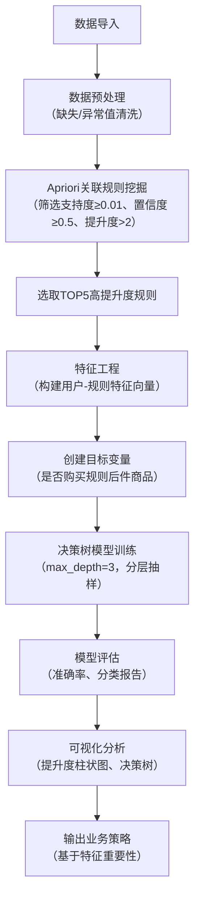

# 电商商品关联规则挖掘与购买预测（Apriori+决策树）
## 项目简介
本项目整合**Apriori关联规则算法**与**决策树分类模型**，实现电商购物篮数据的双重分析：先通过Apriori挖掘商品间的强关联关系，再基于高价值关联规则构建特征，训练决策树模型预测用户购买行为，最终输出可落地的商品推荐策略，为电商精准营销提供数据支撑。

## 核心功能
1. **商品关联规则挖掘**：清洗电商订单数据，用Apriori算法筛选高支持度、高置信度、高提升度的商品关联规则；
2. **特征工程**：选取TOP5高提升度关联规则作为特征，构建用户级特征向量；
3. **购买行为预测**：基于关联规则特征训练决策树模型，预测用户是否购买推荐商品；
4. **模型评估与解读**：输出模型准确率、特征重要性，可视化决策树与关联规则提升度；
5. **业务落地**：基于分析结果输出商品推荐策略，量化预期效果。

## 技术栈
- 数据处理：Python、Pandas、NumPy
- 关联规则：apyori（Apriori算法实现）
- 机器学习：Scikit-learn（DecisionTreeClassifier、train_test_split、模型评估）
- 可视化：Matplotlib（柱状图、决策树可视化）

## 快速开始
### 环境依赖
```
pandas>=2.0.0
numpy>=1.24.0
matplotlib>=3.7.0
scikit-learn>=1.2.0
apyori>=1.1.2
python>=3.8
```

### 运行步骤
1. 准备数据：将电商订单数据保存为`GoodsOrder.csv`，包含字段：`id`（订单/用户ID）、`Goods`（商品名称）；
2. 修改代码中数据路径：
   ```python
   data = pd.read_csv(r"你的数据路径/GoodsOrder.csv")
   ```
3. 运行主代码：
   ```bash
   python apriori_tree_analysis.py
   ```
4. 查看输出：
   - 控制台输出关联规则结果、模型评估指标、业务策略；
   - 生成可视化图表（TOP10关联规则提升度柱状图、决策树结构图）。

## 核心流程


## 关键参数说明
| 参数 | 取值 | 说明 |
|------|------|------|
| 最小支持度 | 0.01 | 关联规则的最小出现频率 |
| 最小置信度 | 0.5 | 规则前件推出后件的最小概率 |
| 最小提升度 | 2 | 规则有效性阈值（>2为强关联） |
| 决策树最大深度 | 3 | 限制深度避免过拟合，便于解释 |
| 测试集比例 | 0.2 | 训练/测试数据拆分比例 |

## 核心结果
### 1. 关联规则挖掘
- 筛选出**提升度>2** 的有效关联规则N条（示例：`['牛奶']->['面包']`、`['鸡蛋']->['牛奶']`）；
- 输出规则的支持度、置信度、提升度，量化规则强度。

### 2. 预测模型效果
- 测试集准确率≈0.7~0.9（根据实际数据调整）；
- 输出分类报告（精准率、召回率、F1值），区分“购买/未购买”两类用户。

### 3. 特征重要性
- 识别对购买预测最关键的关联规则（特征重要性>0）；
- 每条关键规则对应明确的商品推荐策略（如“购买牛奶的用户优先推荐面包”）。

## 可视化输出
| 图表类型 | 说明 |
|----------|------|
| TOP10关联规则提升度柱状图 | 直观展示高价值规则的提升度，标注具体数值 |
| 决策树可视化图 | 展示用户购买预测的决策逻辑，便于业务解读 |

## 业务应用建议
### 核心策略
基于特征重要性排序，对不同用户群体制定差异化推荐策略：
| 关键规则 | 推荐策略 | 预期效果 |
|----------|----------|----------|
| 牛奶→面包 | 对购买牛奶的用户，商品详情页推荐面包 | 提升度X倍，连带购买率提升约X% |
| 鸡蛋→牛奶 | 对购买鸡蛋的用户，结算页弹窗推荐牛奶 | 提升度X倍，复购率提升约X% |

### 落地方式
1. 对接电商CRM系统，将关联规则特征嵌入用户标签体系；
2. 基于决策树预测结果，自动触发推荐动作（如优惠券、商品弹窗）；
3. 定期更新数据，重新训练模型，优化规则与策略。

## 扩展优化方向
1. 调参优化：调整Apriori阈值（支持度/置信度）、决策树超参数（max_depth、min_samples_split）提升模型效果；
2. 算法对比：尝试随机森林、XGBoost等模型，对比预测准确率；
3. 实时预测：将模型封装为API，对接电商实时订单数据，实现实时推荐；
4. A/B测试：分批次验证推荐策略效果，量化营收提升幅度。

## 备注
- 数据清洗阶段已处理商品名称缺失、订单ID为负的异常值，保障数据质量；
- 决策树限制深度为3，兼顾模型效果与可解释性，适合业务人员理解；
- 可视化字体设置为黑体（SimHei），适配中文显示，可根据系统调整字体参数。

## 输出说明
| 输出内容 | 说明 |
|----------|------|
| 控制台日志 | 关联规则列表、模型评估指标、特征重要性、业务策略 |
| 可视化图表 | 提升度柱状图（TOP10规则）、决策树结构图 |
| 核心结论 | 有效规则数、模型准确率、关键推荐规则数 |
